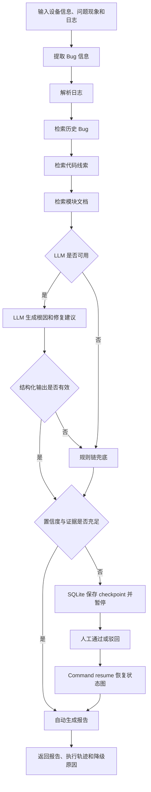

# 嵌入式网通设备 Bug 分析 Agent

这是一个面向路由器、光猫和无线接入设备故障分析场景的 AI Agent 项目。系统接收设备型号、固件版本、问题现象和现场日志，通过 LangGraph 编排信息提取、日志解析、知识检索、根因生成和报告汇总，最终输出可追溯的根因假设、证据和修复建议。

项目默认使用本地规则链，无需生成模型密钥即可运行；本地 `BAAI/bge-small-zh-v1.5` 负责真实语义 Embedding。配置 OpenAI-compatible API 后，可由 LLM 基于检索证据生成根因，并在调用失败或输出校验不通过时自动回退到规则链。

## 核心功能

- 解析 syslog，提取模块、错误模式、关键事件和原始日志证据。
- 识别 DHCP、PPPoE、Wi-Fi、TR-069 和升级回归等问题类型。
- 将模块文档、历史 Bug 和 C 代码统一转换成带来源类型及稳定 ID 的 LangChain `Document`；C 代码使用 tree-sitter 按函数切分并保留绝对行号、调用关系和条件编译上下文。
- 可挂载真实 Git 仓库，把 C/H 文件、Kconfig/Makefile 和最近 Commit Diff 纳入统一检索证据。
- 使用本地中文 BGE 或 OpenAI-compatible Embedding，通过 Chroma 执行语义向量召回。
- 使用加权 RRF 融合双路排名，并通过本地特征、FlashRank 或可选 Sentence Transformers CrossEncoder 对候选 chunk 重排。
- 三类知识源复用统一的向量 + BM25 + RRF + rerank 检索协议，失败时按知识源独立降级。
- 使用 LangGraph 管理多步骤分析状态和节点执行顺序。
- 支持 OpenAI-compatible LLM，并使用 Pydantic 校验结构化 JSON 输出。
- 在 LLM 未配置、请求异常或输出非法时自动执行规则链兜底。
- 使用 SQLite checkpointer 持久化 LangGraph thread；低置信度结果可暂停，提交人工结论后从断点恢复。
- 通过 Redis + RQ 执行持久化后台任务，支持幂等提交、重试、超时、取消和队列内人工复核。
- 使用 API Key 摘要认证和 checkpoint 所有权校验隔离租户任务。
- 通过 Prometheus、Grafana 和 Tempo 观察 HTTP、节点、检索、LLM、fallback、队列和 Trace。
- 通过 FastAPI 提供分析接口，通过 Streamlit 提供可视化操作界面。
- 提供端到端与检索评估集及真实 case 数据契约；真实工单通过带盐摘要、自动脱敏、双人标注和独立仲裁后写入受控目录。

## 分析流程



LangGraph 状态流定义在 `app/graph/bug_analysis_graph.py`，节点实现在 `app/graph/nodes.py`。LLM 只参与根因假设和修复建议生成，日志解析、检索和证据汇总均由确定性代码完成。

## 技术栈

| 组件 | 用途 |
| --- | --- |
| LangGraph | 编排 Bug 分析状态流和节点 |
| LangChain | 文档对象、Embedding 和 Retriever 相关能力 |
| FastAPI | 提供 HTTP API |
| Streamlit | 提供交互式分析页面 |
| Pydantic | 请求参数和 LLM 结构化输出校验 |
| Chroma | 文档、历史 Bug、代码的持久化向量索引 |
| FastEmbed / BGE | CPU 本地中文语义 Embedding |
| rank-bm25 | 错误码、函数名和日志关键词召回 |
| RRF / FlashRank / CrossEncoder | 多路结果融合与二阶段重排 |
| tree-sitter-c | C 代码 AST 函数级切分与源码定位 |
| SQLite checkpointer | 持久化 LangGraph thread 和人工复核断点 |
| Redis / RQ | 持久化任务队列、重试、取消和超时 |
| Prometheus / Grafana / Tempo | 指标、告警、仪表盘和分布式 Trace |
| API Key SHA-256 | API 认证与租户归属映射 |
| Pytest | 单元测试和工作流测试 |

## 快速开始

### 1. 环境要求

- Python 3.11 或更高版本
- Git

### 2. 获取代码并安装依赖

```bash
git clone https://github.com/dreamautumn822-max/embedded-bug-analysis-agent.git
cd embedded-bug-analysis-agent

python3 -m venv .venv
source .venv/bin/activate
pip install -r requirements.txt
cp .env.example .env
```

默认配置中的 `LLM_ENABLED=false`，可以直接使用规则链运行项目。

### 3. 启动 API

```bash
source .venv/bin/activate
uvicorn app.main:app --reload --env-file .env
```

启动后可访问：

- 健康检查：<http://127.0.0.1:8000/health>
- Swagger API 文档：<http://127.0.0.1:8000/docs>
- Prometheus 指标：<http://127.0.0.1:8000/metrics>

### 4. 启动 Web 页面

保持 API 运行，打开另一个终端：

```bash
cd embedded-bug-analysis-agent
source .venv/bin/activate
streamlit run ui/streamlit_app.py
```

页面默认访问地址为 <http://127.0.0.1:8501>，默认调用 `http://127.0.0.1:8000/analyze`。

如 API 部署在其他地址，可在启动 Streamlit 前设置：

```bash
export BUG_AGENT_API_URL=http://your-api-host:8000/analyze
export BUG_AGENT_API_BASE_URL=http://your-api-host:8000
export BUG_AGENT_API_TIMEOUT_SECONDS=90
streamlit run ui/streamlit_app.py
```

### 5. 使用 Docker Compose

准备 `.env` 后可一次启动 API、页面、Redis 和 RQ Worker：

```bash
docker compose up --build -d
docker compose ps
```

- API：<http://127.0.0.1:8000/docs>
- 页面：<http://127.0.0.1:8501>
- 运行配置：<http://127.0.0.1:8000/health/details>

宿主端口冲突时可在 `.env` 中修改 `BUG_AGENT_API_PORT` 和 `BUG_AGENT_UI_PORT`，容器内服务地址无需调整。

首次启动时 `rag-init` 会先下载所需 Embedding 模型并完成 Chroma 索引，再放行 API 和 Worker；这样模型冷启动不会占用业务任务超时。`rag-init` 与 `metrics-init` 随后作为就绪 Sidecar 保持运行，重复执行 `docker compose up -d` 不会在线重建索引或删除指标文件。Chroma 索引、模型缓存、SQLite checkpoint 和 Redis 队列分别写入具名 volume，容器重建后仍可恢复任务与待复核状态。

挂载仓库或知识文档变更后，可协调停止业务进程并重建索引：

```bash
docker compose stop api worker
docker compose restart rag-init
docker compose start api worker
```

启动 Prometheus、Grafana、Tempo 和 Alertmanager：

```bash
docker compose \
  -f docker-compose.yml \
  -f docker-compose.observability.yml \
  up --build -d
```

- Grafana：<http://127.0.0.1:3000>
- Prometheus：<http://127.0.0.1:9090>
- Tempo API：<http://127.0.0.1:3200>
- Alertmanager：<http://127.0.0.1:9093>

本地示例的 Grafana 账号为 `admin/change-me-now`。共享或生产部署必须在 `.env` 中修改 `GRAFANA_ADMIN_PASSWORD`，并同时启用下文的 API Key 认证。

## 配置真实 LLM

项目通过 OpenAI Python SDK 调用 `chat.completions` 接口，因此模型服务需要兼容 OpenAI API 格式。编辑 `.env`：

```bash
LLM_ENABLED=true
LLM_BASE_URL=https://your-provider.example.com/v1
LLM_API_KEY=your-api-key
LLM_MODEL=your-model-name
LLM_TIMEOUT_SECONDS=30
LLM_TEMPERATURE=0.2
```

| 配置项 | 说明 | 默认值 |
| --- | --- | --- |
| `LLM_ENABLED` | 是否启用真实 LLM | `false` |
| `LLM_BASE_URL` | OpenAI-compatible API 基础地址 | - |
| `LLM_API_KEY` | 模型服务密钥 | - |
| `LLM_MODEL` | 模型名称 | - |
| `LLM_TIMEOUT_SECONDS` | 单次请求超时时间 | `30` |
| `LLM_TEMPERATURE` | 生成温度 | `0.2` |

LLM 必须返回包含 `hypotheses` 和 `fix_suggestions` 的 JSON。系统会清理可选的 Markdown 代码块、解析 JSON，并使用 Pydantic 校验字段类型和置信度范围。以下情况会自动回退到本地规则链：

- LLM 未启用或配置不完整。
- 请求超时、鉴权失败或模型服务异常。
- 返回内容为空或不是合法 JSON。
- JSON 不符合预期的数据结构。

## API 使用示例

请求：

```bash
curl -X POST http://127.0.0.1:8000/analyze \
  -H "Content-Type: application/json" \
  -d '{
    "device_model": "AX3000-GW",
    "firmware_version": "v2.1.7",
    "symptom": "固件升级后 LAN 客户端偶发无法通过 DHCP 获取 IP",
    "logs": "2026-06-25 14:03:11 netifd: interface lan reload\n2026-06-25 14:03:12 dhcpd: lease allocation failed\n2026-06-25 14:03:14 kernel: br-lan port state changed to forwarding",
    "module_hint": "network_dhcp"
  }'
```

响应字段：

| 字段 | 说明 |
| --- | --- |
| `bug_type` | 识别出的 Bug 类型 |
| `summary` | 优先级最高的根因标题 |
| `root_causes` | 根因描述列表 |
| `evidence` | 日志、文档、历史 Bug 和代码证据 |
| `hypotheses` | 带置信度和 `evidence_ids` 的结构化根因假设 |
| `evidence_details` | 带类型、来源、分数、章节和 chunk ID 的结构化证据 |
| `fix_suggestions` | 修复与验证建议 |
| `confidence` | 根因置信度，范围为 0 到 1 |
| `generation_mode` | 本次使用 `llm` 还是 `rule` |
| `trace_events` | 每个 LangGraph 节点的状态、耗时和输出数量 |
| `fallback_reasons` | LLM 或检索降级的结构化原因 |
| `review_required` | 是否需要人工复核 |
| `review_status` / `review_reasons` | 复核状态与触发原因 |

### 可暂停人工复核接口

`POST /analyses` 使用持久化图启动分析。高置信度任务直接返回 `completed`；低置信度任务返回 `pending_review`、`analysis_id` 和复核载荷：

```bash
curl -s -X POST http://127.0.0.1:8000/analyses \
  -H 'Content-Type: application/json' \
  -d '{
    "device_model":"Unknown Gateway",
    "firmware_version":"v0.0.1",
    "symptom":"设备出现无法识别的随机异常",
    "logs":"daemon: unexplained status code 777"
  }'
```

使用返回的 `analysis_id` 查询或恢复：

```bash
curl -s http://127.0.0.1:8000/analyses/<analysis_id>

curl -s -X POST http://127.0.0.1:8000/analyses/<analysis_id>/review \
  -H 'Content-Type: application/json' \
  -d '{"approved":true,"reviewer":"qa-owner","comment":"证据已确认"}'
```

checkpoint 默认写入 `run/bug_analysis_checkpoints.sqlite`。`interrupt()` 前的节点状态已持久化，恢复时不会重新执行已完成的日志解析和检索节点。

### 持久化后台任务接口

`POST /v1/jobs` 只负责入队并返回 `202`，RQ Worker 在后台执行 LangGraph。`Idempotency-Key` 在同一租户内防止重复提交：

```bash
curl -X POST http://127.0.0.1:8000/v1/jobs \
  -H 'Content-Type: application/json' \
  -H 'X-API-Key: <raw-api-key>' \
  -H 'Idempotency-Key: ticket-20260715-001' \
  -d '{
    "device_model":"AX3000-GW",
    "firmware_version":"v2.1.7",
    "symptom":"DHCP 客户端无法获取地址",
    "logs":"dhcpd: lease allocation failed bridge br-lan not ready",
    "timeout_seconds":120
  }'
```

查询、取消和复核：

```bash
curl -H 'X-API-Key: <raw-api-key>' http://127.0.0.1:8000/v1/jobs/<job_id>
curl -X DELETE -H 'X-API-Key: <raw-api-key>' http://127.0.0.1:8000/v1/jobs/<job_id>
curl -X POST http://127.0.0.1:8000/v1/jobs/<job_id>/review \
  -H 'Content-Type: application/json' \
  -H 'X-API-Key: <raw-api-key>' \
  -d '{"approved":true,"reviewer":"qa-owner","comment":"证据已确认"}'
```

API Key 不以明文保存在服务端配置中。生成摘要后配置租户映射：

```bash
python scripts/hash_api_key.py
API_AUTH_ENABLED=true
BUG_AGENT_API_KEY_HASHES_JSON={"network-team":"sha256:<64-hex>"}
```

## 知识数据与检索

项目内置了一组可直接运行的演示知识数据：

| 路径 | 内容 |
| --- | --- |
| `data/bugs/bug_history.json` | 历史 Bug、根因和修复记录 |
| `data/codebase/` | 用于演示代码检索的 C 文件 |
| `data/docs/` | DHCP、PPPoE、Wi-Fi 等模块文档 |
| `data/bugs/eval_cases.json` | 自动评估数据集 |
| `data/rag/retrieval_eval_cases.json` | 标注相关 chunk 的检索评估集 |

`app/rag/corpus.py` 把三类知识统一为 `source_type/source/chunk_id` 协议：Markdown 先按标题和 overlap 切分；每条历史 Bug 是一个结构化条目；C 文件由 tree-sitter 解析为函数级 chunk，携带 `symbol/start_line/end_line`，返回阶段将局部命中换算为源码绝对行号。首次分析会创建索引，并根据内容哈希增量增加、更新或删除记录；也可以提前执行：

```bash
python scripts/ingest_docs.py
```

挂载已检出的真实固件仓库后，可索引函数、调用图、条件编译、构建配置和最近提交差异：

```bash
CODEBASE_DIR=/secure/firmware-repo \
RAG_GIT_HISTORY_ENABLED=true \
RAG_GIT_MAX_COMMITS=20 \
python scripts/index_git_repository.py \
  --repo /secure/firmware-repo --max-commits 20
```

Docker 使用 `CODE_REPOSITORY_PATH` 把宿主机仓库只读挂载到 `/workspace/repository`。Commit 作者信息不会进入索引，Diff 长度由 `RAG_GIT_DIFF_MAX_CHARS` 限制。

推荐配置使用 FastEmbed 在 CPU 上运行 `BAAI/bge-small-zh-v1.5`。首次运行从 FastEmbed 官方 Qdrant 镜像下载约 55 MB 压缩模型，解压后约 95 MB；后续直接读取 `.cache/embeddings`：

```bash
EMBEDDING_PROVIDER=fastembed
EMBEDDING_MODEL=BAAI/bge-small-zh-v1.5
EMBEDDING_CACHE_DIR=.cache/embeddings
```

`LocalHashEmbeddings` 仍保留为无需模型下载的词法回退和测试基线，但不等同于语义模型。也可配置 OpenAI-compatible Embedding 接口：

```bash
EMBEDDING_PROVIDER=openai
EMBEDDING_MODEL=text-embedding-3-small
EMBEDDING_BASE_URL=https://your-provider.example.com/v1
EMBEDDING_API_KEY=your-api-key
```

默认 `RAG_RERANK_PROVIDER=local` 使用可离线复现的查询覆盖率、技术标识符、章节标题、BM25 和向量分数组合重排。需要 CPU 模型级重排时切换到 FlashRank；首次运行会把约 150 MB 的多语言 ONNX 模型下载到缓存目录：

```bash
RAG_RERANK_PROVIDER=flashrank
RAG_RERANK_MODEL=ms-marco-MultiBERT-L-12
python scripts/warmup_reranker.py --provider flashrank
```

FlashRank 使用 ONNX CrossEncoder 联合编码“查询 + 候选 chunk”，无需 PyTorch。项目也支持 `cross_encoder` provider；该方式需先执行 `pip install -r requirements-rerank.txt`。模型级重排通常比本地特征更耗时，加载或推理失败时系统会自动回退。

| 配置项 | 说明 | 默认值 |
| --- | --- | --- |
| `CHROMA_DIR` | Chroma 持久化目录 | `.chroma` |
| `DOCS_DIR` | Markdown 知识库目录 | `data/docs` |
| `RAG_TOP_K` | 每次最多召回的文档数 | `3` |
| `RAG_SCORE_THRESHOLD` | 最低相关度阈值，范围 0 到 1 | `0.1` |
| `RAG_CHUNK_SIZE` | 单个 chunk 的最大近似文本单元数 | `300` |
| `RAG_CHUNK_OVERLAP` | 相邻 chunk 的重叠文本单元数 | `50` |
| `RAG_RETRIEVAL_MODE` | `vector`、`bm25` 或 `hybrid` | `hybrid` |
| `RAG_CANDIDATE_K` | 向量和 BM25 各自的候选数 | `8` |
| `RAG_RRF_K` | RRF 排名平滑常数 | `60` |
| `RAG_VECTOR_WEIGHT` | 向量结果在 RRF 中的权重 | `1.0` |
| `RAG_BM25_WEIGHT` | BM25 结果在 RRF 中的权重 | `1.0` |
| `RAG_RERANK_PROVIDER` | `none`、`local`、`flashrank` 或 `cross_encoder` | `local` |
| `RAG_RERANK_MODEL` | 模型重排器名称 | `ms-marco-MultiBERT-L-12` |
| `RAG_RERANK_WEIGHT` | 重排分相对 RRF 分的权重 | `0.65` |
| `RAG_RERANK_CACHE_DIR` | 重排模型缓存目录 | `.cache/rerank` |
| `RAG_RERANK_MAX_LENGTH` | 查询与 chunk 的最大模型长度 | `256` |
| `EMBEDDING_PROVIDER` | `local`、`fastembed` 或 `openai` | 代码默认 `local`，示例配置为 `fastembed` |
| `EMBEDDING_MODEL` | Embedding 模型或本地实现标识 | `BAAI/bge-small-zh-v1.5`（示例配置） |
| `EMBEDDING_DIMENSIONS` | 本地词法向量维度，仅 `local` 生效 | `1024` |
| `EMBEDDING_CACHE_DIR` | FastEmbed 模型缓存 | `.cache/embeddings` |
| `EMBEDDING_MAX_LENGTH` | FastEmbed 最大输入长度 | `512` |
| `EMBEDDING_THREADS` | ONNX 推理线程数，空值为自动 | - |
| `EMBEDDING_BASE_URL` | OpenAI-compatible Embedding 地址 | - |
| `EMBEDDING_API_KEY` | Embedding 服务密钥 | - |
| `LANGGRAPH_CHECKPOINT_PATH` | 人工复核 thread 的 SQLite 文件 | `run/bug_analysis_checkpoints.sqlite` |
| `CODEBASE_DIR` | 本地代码或 Git 仓库根目录 | `data/codebase` |
| `RAG_GIT_HISTORY_ENABLED` | 是否索引最近 Commit Diff | `false` |
| `RAG_GIT_MAX_COMMITS` | 最多索引的最近提交数 | `20` |
| `RAG_GIT_DIFF_MAX_CHARS` | 单个 Diff 最大字符数 | `12000` |

三个检索节点分别组合适合本知识源的查询，但底层都调用 `retrieve_knowledge_source()`。Chroma 与 BM25 各召回 `RAG_CANDIDATE_K` 个候选，RRF 按名次融合去重，reranker 选出最终 `RAG_TOP_K`。结果统一携带向量/BM25 原始排名、融合分、重排分和证据 ID。`HybridDocumentRetriever` 实现 LangChain `BaseRetriever` 接口，其他 Chain 可通过 `.invoke(query)` 复用文档链路。单路失败时继续使用另一条召回链；双路失败或无结果时，对应节点回退到关键词工具并写入 `fallback_reasons`。

## 测试与评估

运行全部测试：

```bash
pytest -q
```

使用确定性规则链运行评估：

```bash
python scripts/evaluate.py --disable-llm
```

评估前校验 case 来源、标注和脱敏契约：

```bash
python scripts/validate_eval_dataset.py
python scripts/validate_eval_dataset.py --cases /secure/path/real_cases.json --require-production
```

授权的原始工单必须在仓库外准备，再导入默认被 Git 忽略的受控目录：

```bash
export BUG_AGENT_CASE_HASH_SALT='<at-least-16-random-characters>'
python scripts/import_real_cases.py \
  --input /secure/raw/adjudicated_cases.json \
  --output run/private_eval/real_eval_cases.json
python scripts/validate_eval_dataset.py \
  --cases run/private_eval/real_eval_cases.json \
  --require-production
```

原始记录必须有至少两名不同标注者、独立仲裁者和人工脱敏确认。导入过程会清除 MAC、IP、邮箱、序列号、账号和主机名，并使用带盐 HMAC 替换工单号。

加载 `.env` 并评估真实 LLM，多次运行可观察输出稳定性：

```bash
python scripts/evaluate.py --load-env --repeat 2
```

单独评估 RAG 检索排序：

```bash
python scripts/evaluate_retrieval.py --top-k 5
python scripts/evaluate_retrieval.py --top-k 3 --compare
python scripts/evaluate_retrieval.py --top-k 3 --compare-embeddings
```

评估脚本输出以下指标：

- `classification_accuracy`：Bug 类型识别准确率。
- `parser_coverage`：日志解析覆盖率。
- `root_cause_hit_rate`：预期根因关键词命中率。
- `evidence_coverage`：预期证据覆盖率。
- `citation_validity`：根因引用的证据 ID 是否真实存在。
- `retrieval_provenance_coverage`：检索证据是否携带召回来源元数据。
- `review_routing_accuracy`：低置信度人工复核路由是否符合标注。
- `output_stability`：重复运行时输出稳定性。

检索评估基于人工标注的相关 chunk ID，输出 `Recall@K`、`Precision@K`、`Hit Rate@K`、`MRR`、`nDCG@K`、平均延迟和 P95 延迟。内置 20 条 case，包含同模块干扰、否定条件和纯中文语义改写；它们只用于建立可复现基线，不代表生产准确率。

当前离线演示集的一次 `Top-3` 消融结果如下。该结果用于验证评估闭环，不代表生产准确率：

| 检索策略 | Recall@3 | MRR | nDCG@3 | 平均热延迟 |
| --- | ---: | ---: | ---: | ---: |
| LocalHash 向量 | 0.8000 | 0.7667 | 0.7750 | 约 18 ms |
| BGE 中文语义向量 | 0.9500 | 0.8917 | 0.9065 | 热查询约 5-17 ms |
| BGE + BM25 + RRF + 本地重排 | 0.9500 | 0.9000 | 0.9131 | 热查询约 20-32 ms |

真实 BGE 明显优于词法 Hash，但语义改写困难样例仍有漏召回，因此生产前仍需加入真实 case，并评估领域 reranker 或查询改写。端到端规则链的 5 条样例同时覆盖常规自动报告与低置信度复核路由，各项指标为 1.00；样本规模较小，不能表述为生产准确率。

## 项目结构

```text
.
├── app/
│   ├── chains/          # 信息提取、规则根因和报告生成
│   ├── graph/           # LangGraph 状态、节点和工作流
│   ├── evaluation/      # 真实/合成评估 case 数据契约
│   ├── jobs/            # Redis/RQ 队列、任务状态和 Worker 函数
│   ├── llm/             # LLM 配置、调用和输出模型
│   ├── rag/             # 文档加载、Chroma 和 Retriever
│   ├── observability/   # Prometheus 指标与 OpenTelemetry Trace
│   ├── security/        # API Key 摘要认证与租户身份
│   ├── schemas/         # API 请求与响应模型
│   ├── tools/           # 日志、历史 Bug 和代码检索工具
│   └── main.py          # FastAPI 入口
├── data/                # 演示知识库、日志和评估集
├── docs/                # 设计文档、SOP 和 PlantUML 架构图
├── loadtests/           # Locust 后台任务压测场景
├── observability/       # Prometheus、Grafana、Tempo 和告警配置
├── scripts/             # 文档索引与评估脚本
├── tests/               # 自动化测试
├── ui/                  # Streamlit 前端
├── .github/workflows/   # GitHub Actions 持续集成
├── Dockerfile           # API/UI 共用镜像
├── docker-compose.yml   # API、UI、Redis、Worker 与持久卷
├── docker-compose.observability.yml # 可选观测栈 Overlay
├── .env.example         # 环境变量模板
└── requirements.txt     # Python 依赖
```

## 详细文档

- [项目文档入口](docs/README.md)
- [设计与实现详解](docs/architecture/design-and-implementation.md)
- [使用 SOP](docs/embedded-bug-agent-sop.md)
- [系统组件图](docs/architecture/system-components.puml)
- [LangGraph 状态流图](docs/architecture/langgraph-state-flow.puml)
- [API 调用时序图](docs/architecture/api-sequence.puml)
- [LLM 兜底流程图](docs/architecture/llm-fallback-flow.puml)
- [运行部署图](docs/architecture/runtime-deployment.puml)
- [真实故障 Case 接入与评估规范](docs/evaluation/real-case-intake.md)
- [生产化扩展与运行手册](docs/production/productionization.md)
- [队列接口压测说明](loadtests/README.md)

## 当前边界

- 仓库仍不包含真实生产 Case；只提供受控导入链路，不能据合成集声明生产准确率。
- Git 索引要求使用调用方已经检出的本地仓库，不负责保存 Git 凭据或从远端拉取私有代码。
- 调用图当前基于直接 C 函数调用，不解析函数指针、运行时注册表、跨语言调用和完整编译数据库。
- API Key 已隔离任务与 checkpoint，但所有租户仍共享文档、历史 Bug、代码和向量集合；严格知识库隔离需要按租户拆分 collection。
- SQLite WAL 可支持当前 API + Worker 单机部署；多主机、多副本生产环境仍应迁移到 PostgreSQL checkpointer。
- Alertmanager 默认接收器只保留告警状态，企业部署需配置飞书、邮件或值班平台 Webhook。
- Locust 场景已经提供，但容量阈值必须在目标硬件、真实模型时延和合规的脱敏数据上重新测量。
