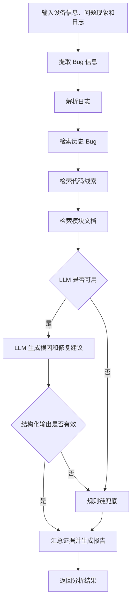

# 嵌入式网通设备 Bug 分析 Agent

这是一个面向路由器、光猫和无线接入设备故障分析场景的 AI Agent 项目。系统接收设备型号、固件版本、问题现象和现场日志，通过 LangGraph 编排信息提取、日志解析、知识检索、根因生成和报告汇总，最终输出可追溯的根因假设、证据和修复建议。

项目默认使用本地规则链，无需模型密钥即可运行；配置 OpenAI-compatible API 后，可由 LLM 基于检索到的证据生成根因，并在调用失败或输出校验不通过时自动回退到规则链。

## 核心功能

- 解析 syslog，提取模块、错误模式、关键事件和原始日志证据。
- 识别 DHCP、PPPoE、Wi-Fi、TR-069 和升级回归等问题类型。
- 检索历史 Bug、模块文档和示例 C 代码中的相关线索。
- 使用 LangGraph 管理多步骤分析状态和节点执行顺序。
- 支持 OpenAI-compatible LLM，并使用 Pydantic 校验结构化 JSON 输出。
- 在 LLM 未配置、请求异常或输出非法时自动执行规则链兜底。
- 通过 FastAPI 提供分析接口，通过 Streamlit 提供可视化操作界面。
- 提供评估集和自动化测试，覆盖分类、日志解析、根因、证据及稳定性指标。

## 分析流程



LangGraph 状态流定义在 `app/graph/bug_analysis_graph.py`，节点实现在 `app/graph/nodes.py`。LLM 只参与根因假设和修复建议生成，日志解析、检索和证据汇总均由确定性代码完成。

## 技术栈

| 组件 | 用途 |
| --- | --- |
| LangGraph | 编排 Bug 分析状态流和节点 |
| LangChain | 文档对象、Embedding 和 Retriever 相关能力 |
| FastAPI | 提供 HTTP API |
| Streamlit | 提供交互式分析页面 |
| Pydantic | 请求参数和 LLM 结构化输出校验 |
| Chroma | 本地文档向量索引实验能力 |
| Pytest | 单元测试和工作流测试 |

## 快速开始

### 1. 环境要求

- Python 3.11 或更高版本
- Git

### 2. 获取代码并安装依赖

```bash
git clone https://github.com/dreamautumn822-max/embedded-bug-analysis-agent.git
cd embedded-bug-analysis-agent

python3 -m venv .venv
source .venv/bin/activate
pip install -r requirements.txt
cp .env.example .env
```

默认配置中的 `LLM_ENABLED=false`，可以直接使用规则链运行项目。

### 3. 启动 API

```bash
source .venv/bin/activate
uvicorn app.main:app --reload --env-file .env
```

启动后可访问：

- 健康检查：<http://127.0.0.1:8000/health>
- Swagger API 文档：<http://127.0.0.1:8000/docs>

### 4. 启动 Web 页面

保持 API 运行，打开另一个终端：

```bash
cd embedded-bug-analysis-agent
source .venv/bin/activate
streamlit run ui/streamlit_app.py
```

页面默认访问地址为 <http://127.0.0.1:8501>，默认调用 `http://127.0.0.1:8000/analyze`。

如 API 部署在其他地址，可在启动 Streamlit 前设置：

```bash
export BUG_AGENT_API_URL=http://your-api-host:8000/analyze
export BUG_AGENT_API_TIMEOUT_SECONDS=90
streamlit run ui/streamlit_app.py
```

## 配置真实 LLM

项目通过 OpenAI Python SDK 调用 `chat.completions` 接口，因此模型服务需要兼容 OpenAI API 格式。编辑 `.env`：

```bash
LLM_ENABLED=true
LLM_BASE_URL=https://your-provider.example.com/v1
LLM_API_KEY=your-api-key
LLM_MODEL=your-model-name
LLM_TIMEOUT_SECONDS=30
LLM_TEMPERATURE=0.2
```

| 配置项 | 说明 | 默认值 |
| --- | --- | --- |
| `LLM_ENABLED` | 是否启用真实 LLM | `false` |
| `LLM_BASE_URL` | OpenAI-compatible API 基础地址 | - |
| `LLM_API_KEY` | 模型服务密钥 | - |
| `LLM_MODEL` | 模型名称 | - |
| `LLM_TIMEOUT_SECONDS` | 单次请求超时时间 | `30` |
| `LLM_TEMPERATURE` | 生成温度 | `0.2` |

LLM 必须返回包含 `hypotheses` 和 `fix_suggestions` 的 JSON。系统会清理可选的 Markdown 代码块、解析 JSON，并使用 Pydantic 校验字段类型和置信度范围。以下情况会自动回退到本地规则链：

- LLM 未启用或配置不完整。
- 请求超时、鉴权失败或模型服务异常。
- 返回内容为空或不是合法 JSON。
- JSON 不符合预期的数据结构。

## API 使用示例

请求：

```bash
curl -X POST http://127.0.0.1:8000/analyze \
  -H "Content-Type: application/json" \
  -d '{
    "device_model": "AX3000-GW",
    "firmware_version": "v2.1.7",
    "symptom": "固件升级后 LAN 客户端偶发无法通过 DHCP 获取 IP",
    "logs": "2026-06-25 14:03:11 netifd: interface lan reload\n2026-06-25 14:03:12 dhcpd: lease allocation failed\n2026-06-25 14:03:14 kernel: br-lan port state changed to forwarding",
    "module_hint": "network_dhcp"
  }'
```

响应字段：

| 字段 | 说明 |
| --- | --- |
| `bug_type` | 识别出的 Bug 类型 |
| `summary` | 优先级最高的根因标题 |
| `root_causes` | 根因描述列表 |
| `evidence` | 日志、文档、历史 Bug 和代码证据 |
| `fix_suggestions` | 修复与验证建议 |
| `confidence` | 根因置信度，范围为 0 到 1 |

## 知识数据与检索

项目内置了一组可直接运行的演示知识数据：

| 路径 | 内容 |
| --- | --- |
| `data/bugs/bug_history.json` | 历史 Bug、根因和修复记录 |
| `data/codebase/` | 用于演示代码检索的 C 文件 |
| `data/docs/` | DHCP、PPPoE、Wi-Fi 等模块文档 |
| `data/logs/` | 示例设备日志 |
| `data/bugs/eval_cases.json` | 自动评估数据集 |

当前主工作流使用结构化匹配和关键词重叠完成历史 Bug、代码及文档检索。项目同时提供 Chroma 向量索引能力，用于演示 LangChain Document、Embedding 和 Retriever 的组合方式：

```bash
python scripts/ingest_docs.py
```

该命令使用 `FakeEmbeddings` 在 `.chroma/` 生成本地索引，不需要 API Key。当前 Chroma Retriever 尚未接入 LangGraph 主分析流程。

## 测试与评估

运行全部测试：

```bash
pytest -q
```

使用确定性规则链运行评估：

```bash
python scripts/evaluate.py --disable-llm
```

加载 `.env` 并评估真实 LLM，多次运行可观察输出稳定性：

```bash
python scripts/evaluate.py --load-env --repeat 2
```

评估脚本输出以下指标：

- `classification_accuracy`：Bug 类型识别准确率。
- `parser_coverage`：日志解析覆盖率。
- `root_cause_hit_rate`：预期根因关键词命中率。
- `evidence_coverage`：预期证据覆盖率。
- `output_stability`：重复运行时输出稳定性。

## 项目结构

```text
.
├── app/
│   ├── chains/          # 信息提取、规则根因和报告生成
│   ├── graph/           # LangGraph 状态、节点和工作流
│   ├── llm/             # LLM 配置、调用和输出模型
│   ├── rag/             # 文档加载、Chroma 和 Retriever
│   ├── schemas/         # API 请求与响应模型
│   ├── tools/           # 日志、历史 Bug 和代码检索工具
│   └── main.py          # FastAPI 入口
├── data/                # 演示知识库、日志和评估集
├── docs/                # 设计文档、SOP 和 PlantUML 架构图
├── scripts/             # 文档索引与评估脚本
├── tests/               # 自动化测试
├── ui/                  # Streamlit 前端
├── .env.example         # 环境变量模板
└── requirements.txt     # Python 依赖
```

## 详细文档

- [项目文档入口](docs/README.md)
- [设计与实现详解](docs/architecture/design-and-implementation.md)
- [使用 SOP](docs/embedded-bug-agent-sop.md)
- [系统组件图](docs/architecture/system-components.puml)
- [LangGraph 状态流图](docs/architecture/langgraph-state-flow.puml)
- [API 调用时序图](docs/architecture/api-sequence.puml)
- [LLM 兜底流程图](docs/architecture/llm-fallback-flow.puml)

## 当前边界

- 内置知识库和代码均为演示数据，不包含真实设备仓库或生产 Bug 数据。
- 主流程的检索策略以关键词匹配为主，尚未加入向量召回、混合检索和重排序。
- 工作流当前为固定顺序执行，尚未加入低置信度分支、人工复核和断点恢复。
- 项目暂未实现用户认证、分析任务持久化和多租户知识库隔离。

后续计划包括将 Chroma Retriever 接入主流程、增加混合检索与重排序、完善节点级可观测性，并为低置信度结果增加人工复核分支。
